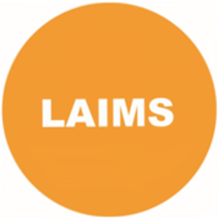

<!-- README.md is generated from README.Rmd. Please edit that file -->

```{r, include = FALSE}
knitr::opts_chunk$set(
  collapse = TRUE,
  comment = "#>",
  fig.path = "man/figures/README-",
  out.width = "100%"
)
```

# laims.analisi 

<!-- badges: start -->
[](https://lifecycle.r-lib.org/articles/stages.html#experimental)
<!-- badges: end -->


This project would represent the template for the analyses conducted  within the Laboratory of Artificial Intelligence from the Medical  Sciences (LAIMS) at the Unit of Biostatistics, Epidemiology, and Public health (UBEP) within the Department of Cardiac, Thoracic, Vascular Sciences, and Public Health (DSCTVPH) of the University of Padova (UniPD).


The aim is to provide a ready-to-use robust, reproducible infrastructure for complex to quick analyses.

When you create a new project based on this template, name it accordingly with your project's name. Next, you can open the `dev/01-dev_cycle.R` script, and  execute the code and instructions within the first chunk labelled as **FIRST RUN ONLY**. There, you will have the opportunity to set the very first and basic pieces of information for your project, and activate all its functionalities.


## Functionalities

- A dedicated packages' **project-level library** powered by `{renv}`
- All the **documentation** for functions and the project itself powered by `{roxygen2}`
- A **test-driven environment** powered by `{testthat}` and `{checkmate}`, including an addin for continuous monitoring of codes and tests changes, automatically triggering tests as needed, powered by `{CorradoLanera/autotestthat}`
- Systems for grammar and static code checking powered by `{spelling}` and `{lintr}`, respectively
- A full environment enforcing reproducibility by the execution, caching and invalidation of a structured project's pipeline powered by `{targets}` and `{tarchetypes}` in conjunction and synergy with Rmarkdown scientifically flavored documents powered by `{distill}` (with options for connections with Zotero as citation manager, linked with local or remote libraries)


## Code of Conduct

Please note that the `laims.analysis` project is released with a [Contributor Code of Conduct](https://contributor-covenant.org/version/2/0/CODE_OF_CONDUCT.html). By contributing to this project, you agree to abide by its terms.
